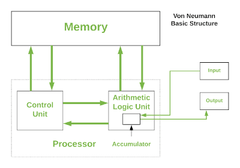
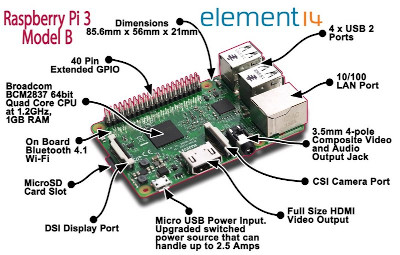

>#“Simple things should be simple, complex things should be possible.” ― Alan Kay 

###About Me

<!-- Please write a short pargraph about you -->


<!--end of modification -->

### Text Book 
**[CS For All by Christine Alvarado, Zachary Dodds, Geoff Kuenning, Ran Libeskind-Hadas](https://www.cs.hmc.edu/csforallbook/) **

You may find more students resource [here](https://www.cs.hmc.edu/twiki/bin/view/CSforAll/). 

## Principle Areas of Study within Computer Science

### Programming Language-python

Snapshot of python "Hello World"
```
def HelloWorld(username, message):
    print("Hello " , username, ", From my heart!  I wish you", message)

HelloWorld("Yilian Zhang", "a great semester!")
```


### Computer systems
Basci structure | A mini computer Raspberry Pi 
----------------|------------------------------
|

### Web and Network


### Security


### Vision and graphics


### Database systems


### Artificial intelligence


### Support or Contact

Having trouble with Course? Check out our [documentation](https://www.github.com/yilianz/CSCI125) or [contact instructor](yilianz@usca.edu) @yilianz and we’ll help you sort it out.